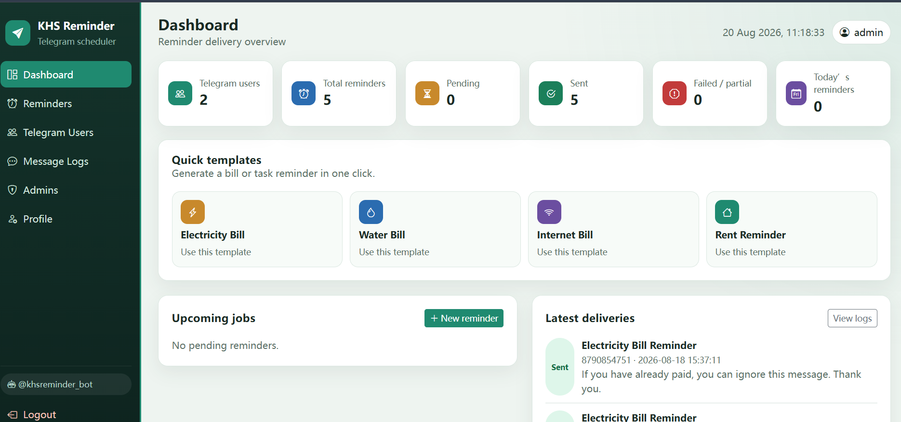
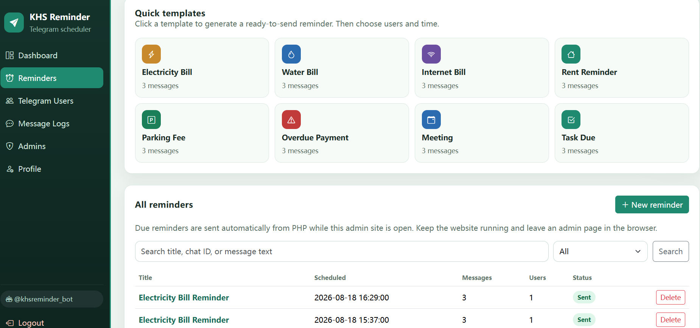
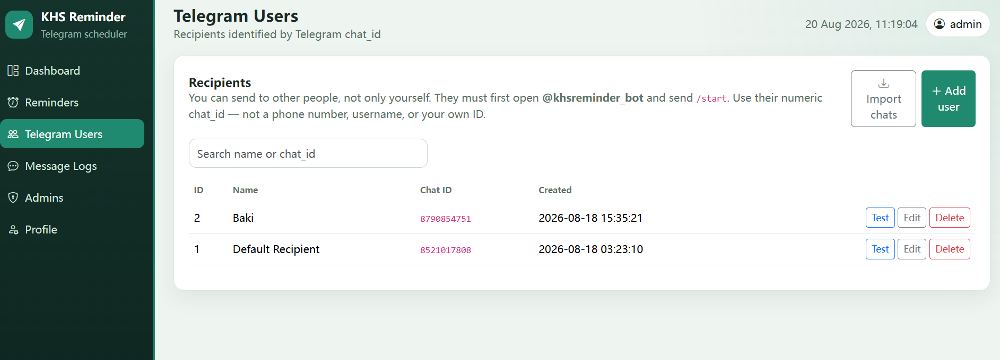
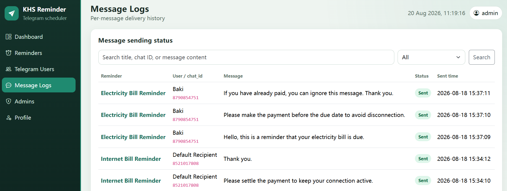

# KHS Reminder

Telegram 定时提醒管理系统。适合学习 **Core PHP + MySQL + Cron + Telegram Bot API** 的教学项目。

后台可管理提醒、Telegram 用户、发送记录和管理员账号。到期后由 Cron（或后台保活）自动把消息按顺序发给指定 `chat_id`。

## Screenshots

### Dashboard

### Reminders

### Telegram Users

### Message Logs

## Features

- 一键账单 / 会议 / 任务等提醒模板
- 同一提醒可发给多个 Telegram 用户，并按顺序发送多条消息
- 发送状态：Pending / Sent / Failed / Partial
- 每条消息的投递日志
- 管理员登录、忘记密码、个人资料

## Tech stack

- PHP 7.4+（无需 Composer / Laravel）
- MySQL / MariaDB
- Telegram Bot API
- 每分钟 Cron（cPanel 可用）

## Quick start

1. 在 cPanel 创建 MySQL 数据库和用户。
2. 把项目上传到 `public_html/`（或子目录）。
3. 打开 `/install.php` 填写数据库、管理员和 Bot Token；或导入 `database/schema.sql` 后编辑 `/config`。
4. 用 `/admin/login.php` 登录，添加 Telegram 用户，创建提醒。
5. 配置每分钟 Cron，详见 [INSTALL.md](INSTALL.md)。
6. 安装成功后删除 `install.php`。

默认登录（安装后请立刻修改）：

- 地址：`/admin/login.php`
- 用户名：`admin`
- 密码：`Admin@123`

## Configuration

把真实主机信息只放在服务器上的配置文件里，不要提交到 GitHub：

| File | Purpose |
| --- | --- |
| `config/database.php` | 数据库主机、库名、用户名、密码 |
| `config/telegram.php` | Bot Token、机器人用户名 |
| `config/app.php` | 时区、`app_key`、`cron_secret` |

仓库里这些文件只保留占位符，例如 `YOUR_DATABASE_NAME`、`YOUR_DATABASE_USER`、`YOUR_DATABASE_PASSWORD`。

## Docs

- [INSTALL.md](INSTALL.md) — 主机、数据库、Cron
- [TELEGRAM_SETUP.md](TELEGRAM_SETUP.md) — BotFather、`chat_id`、测试发送
- [CPANEL_UPLOAD.txt](CPANEL_UPLOAD.txt) — cPanel 上传步骤

## License

本项目以教育学习为目的发布，详见 [LICENSE](LICENSE)。
